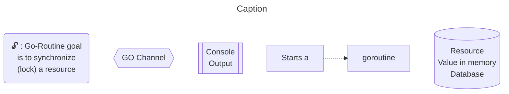
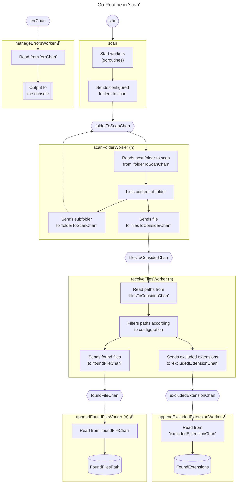

Scan Threading
===

Here's a visual explanation of how the `scan` function pans out goroutines to achieve its goal.

```mermaid
---
title: Caption
---
flowchart LR
Lock("🔓 : Go-Routine goal\nis to synchronize\n(lock) a resource")
Lock ~~~ Chan
Chan{{GO Channel}}
Chan ~~~ Out
Out[[Console\nOutput]]
Out ~~~ AsyncLeft
AsyncLeft["Starts a"] -.-> AsyncRight["goroutine"]
AsyncRight ~~~ DB
DB[(Resource\nValue in memory\nDatabase)]
```

```mermaid
---
title: "Go-Routine in 'scan'"
---
flowchart TB
start((start)) --> scan
subgraph scan
  startGoroutines["Start workers\n(goroutines)"]
  startGoroutines --> scanSendFolders["Sends configured\nfolders to scan"]
end


excludedExtensionChan{{excludedExtensionChan}}
filesToConsiderChan{{filesToConsiderChan}}
foundFileChan{{foundFileChan}}
folderToScanChan{{folderToScanChan}}
errChan{{errChan}}

errChan -.-> manageErrorsWorkerRead
scanSendFolders -.-> folderToScanChan
foundFileChan -.-> appendFoundFileWorkerRead
excludedExtensionChan -.-> appendExcludedExtensionWorkerRead
filesToConsiderChan -.-> receiveFilesWorkerRead
receiveFilesWorkerSend -.-> foundFileChan
folderToScanChan -.-> scanFolderRead
scanFolderSendFolder -.-> folderToScanChan
scanFolderSendFile -.-> filesToConsiderChan
receiveFilesWorkerSendExcludedExt -.-> excludedExtensionChan

subgraph appendFoundFileWorkerGraph["appendFoundFileWorker (n) 🔓"]
  appendFoundFileWorkerRead["Read from 'foundFileChan'"]
  appendFoundFileWorkerRead --> FoundFilesPaths[(FoundFilesPath)]
end

subgraph appendExcludedExtensionWorker["appendExcludedExtensionWorker 🔓"]
  appendExcludedExtensionWorkerRead["Read from\n'excludedExtensionChan'"]
  appendExcludedExtensionWorkerRead --> FoundExtensions[(FoundExtensions)]
end

subgraph manageErrorsWorker["manageErrorsWorker 🔓"]
  manageErrorsWorkerRead["Read from 'errChan'"]
  manageErrorsWorkerRead --> manageErrorsWorkerOutput[["Output to\nthe console"]]
end

subgraph receiveFilesWorker["receiveFilesWorker (n)"]
  receiveFilesWorkerRead["Read paths from\n'filesToConsiderChan'"]
  receiveFilesWorkerRead --> receiveFilesWorkerFilter["Filters paths according\nto configuration"]
  receiveFilesWorkerFilter --> receiveFilesWorkerSend["Sends found files\nto 'foundFileChan'"]
  receiveFilesWorkerFilter --> receiveFilesWorkerSendExcludedExt["Sends excluded extensions\nto 'excludedExtensionChan'"]
end

subgraph scanFolderWorker["scanFolderWorker (n)"]
  scanFolderRead["Reads next folder to scan\nfrom 'folderToScanChan'"]
  scanFolderRead --> scanFolderList["Lists content of folder"]
  scanFolderList --> scanFolderSendFolder["Sends subfolder\nto 'folderToScanChan'"]
  scanFolderList --> scanFolderSendFile["Sends file\nto 'filesToConsiderChan'"]
end
```